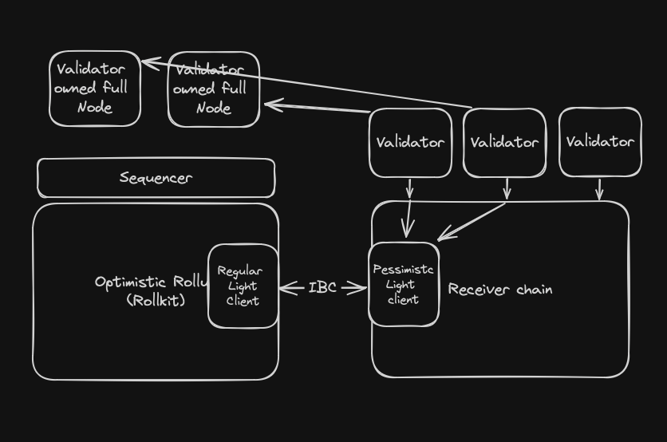
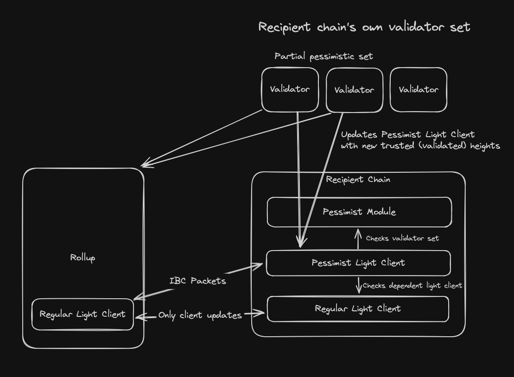
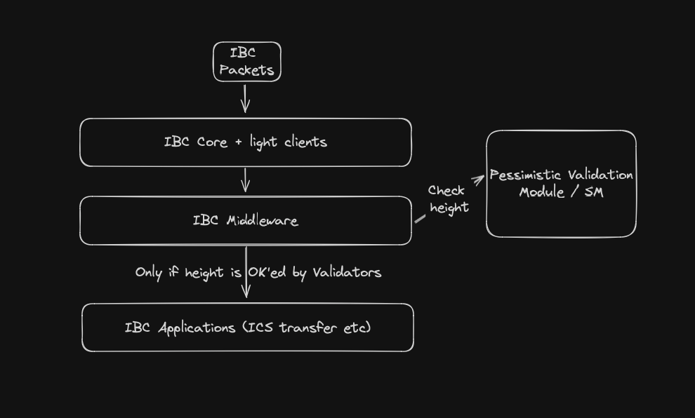

# Pessimistic Validation

Main goal: to allow optimistic rollups to IBC without having to wait for the dispute period.

The problem of bridging in reasonable time from optimistic rollups are required to be solved in order for them to be useful
in an interchain context where token bridging over IBC is one of the main use cases.

This repo is a proof of concept for the second solution: pessimistic validation.

## Pessimistic Validation

Pessimistic validation is where you validate all the blocks on the whole rollup chain, rather than optimistic trust or waiting for dispute periods.
This is essentially the way most full L1 blockchains works today, but with a twist: the rollup can still run as an optimistic rollup and the receiver chain can
pessimistically validate the rollup chain with a partial set from their own validators.

For an optimistic rollup, to bridge assets you normally need to wait for the dispute period to pass before you can trust the rollup
and the assets bridged over. This is because the rollup chain can be rolled back if a fraud proof is submitted within the dispute period.

Anyone can however validate the rollup themselves with a full node, but it doesn't help the receiving chain unless it can either validate it itself or a have a trusted party validate it.

The goal of pessimistic validation is to allow a receving chain to have a partial set of its validators validate the rollup chain and sign off on the heights they trust. 
This way the receiving chain can trust the rollup chain without having to wait for the dispute period to pass, and assets can be bridged over quickly.

## Implementation

The implementation of pessimist validation is done by combining the following:
* A custom SDK module that has "validation objectives" where validators can sign up to validate a rollup chain.
* A custom light client that can be updated with new rollup heights that have been signed off by the validators.
* Implementation of ABCI++ VoteExtensions to allow the light client to be updated with new rollup heights easily (and quickly).

The system sketch below shows how the system works:
1. A new validation objective is created on the receiving chain with a given "required consensus power" requirement
    - The objective also needs a "dependent light client" that is used for the pessimistic light client to prove memberships and stuff like that
2. Validators sign up for the validation objective
3. Once enough validator power has signed up, the validation objective is started and a new pessimistic light client is created
4. The validators set up a config for reading the headers from a full node they control
5. The validators automatically read headers from their full node and sign off on the height by putting them in an ABCI++ VoteExtensions message
6. VoteExtensions are validated (this part is not implemented much in this PoC, just some basic stuff)
7. VoteExtensions are sent to the Pessimistic Light Client in the form of an UpdateClient with a ClientMessage
8. Connections, channels and packets can now be set up between the rollup chain and the receiving chain

> Side note: The VoteExtension implementation could easily be extended to also perform all the relaying on both chains directly.

The whole flow can also be seen in the E2E tests in the `interchaintest` folder.

The following folders are included in this repo:
* `hub/` - Standard Cosmos SDK chain with
* `hub/app/app.go` - ABCI++ VoteExtensions implementation
* `hub/x/pessimist` - Custom SDK module for validation objectives
* `hub/x/pessimist/lightclient` - Custom light client for pessimistic validation
* `rolly/` - A basic Rollkit chain that is used to test the solution
* `mock-da/` - Just a dockerfile for a mock data availability layer used in the tests
* `interchaintest/` - E2E tests for the solution

Some other repos are used where custom forks are made:
* https://github.com/gjermundgaraba/interchaintest/tree/rollkit-celestia-example
* https://github.com/gjermundgaraba/relayer/tree/pessimistic-rollkit
* https://github.com/gjermundgaraba/mock-da

And some custom docker builds are used, which can be found here: https://github.com/gjermundgaraba?tab=packages

In addition to the above we are also using a main-line commit of ibc-go that has the new LightClientModule interface (see hub go.mod).

## Try it yourself
The best way to really see it in action is to run the E2E tests in the `interchaintest` folder.

You will need to build the docker images for the hub and rolly chains. You can do this by running `make build-docker` in the root of the repo.
You will also need to have the relayer with the custom fork installed: https://github.com/gjermundgaraba/relayer/tree/pessimistic-rollkit (notice the `pessimistic-rollkit` branch).

If you want to spin up all the different pieces locally to really test it, you can follow the instructions below:
1. Build the local docker images (hub and rolly) by running `make build-docker` in the root of the repo
2. Spin up the docker compose setup from the root `docker compose up`
    - This spins up a celestia local devnet, the hub and a rollkit chain
    - It takes a bit for all the pieces to start up (especially the rollkit chain we do some sleeps to wait for Celestia to spin up first)
    - To monitor, you can use docker desktop or just follow the rolly logs with `docker logs rolly -f`
3. Set up the relayer with the provided config:
    - `rly config init`
    - `cp rly-docker-compose-config.yaml ~/.relayer/config/config.yaml`
4. Set up the relayer with some accounts that have coins (preconfigured for both chains)
    - `rly keys restore hub default "copy horror distance stick flock tortoise talk robust grape alter quality call climb dumb arrive leopard digital panel scale decide regret digital humble dust"`
    - `rly keys restore rolly default "element achieve battle inject taxi hard purchase merit empower tower steak balance supreme purse assault lens chair dove together danger cat essence offer peace"`
5. Create regular tendermint clients on both sides:
    - `rly tx clients regular-path`
    - `rly tx update-clients regular-path`
6. Create the validation object on the hub, targeting the new light client as the dependent client
    - `docker exec hub hubd tx pessimist create-validation-objective 07-tendermint-0 1000 --chain-id hub --from alice --yes`
    - If you want to see the objective, run `docker exec hub hubd q pessimist validation-objective 07-tendermint-0`
7. Sign the validator up for the objective
    - `docker exec hub hubd tx pessimist sign-up-for-objective 07-tendermint-0 --chain-id hub --from alice --yes`
8. Create the config on the validation node:
    - `docker exec hub cp /code/pessimist_config_example.yaml /root/pessimist.yaml`
9. Enable ABCI++ Vote Extensions (This is usually done with governance, but I hacked it in as a CLI command that can be done by a particular address)
    - Enable the ABCI++ Vote Extensions: `ENABLE_HEIGHT=$(($(docker exec hub hubd status | jq -r ".sync_info.latest_block_height")+15)); docker exec hub hubd tx consensus update-params --abci "{\"vote_extensions_enable_height\": \"$ENABLE_HEIGHT\"}" --block '{"max_bytes": "22020096", "max_gas": "-1"}' --evidence '{"max_age_num_blocks": "100000", "max_age_duration": "172800s", "max_bytes": "1048576"}' --validator '{ "pub_key_types": ["ed25519"] }' --from authority --chain-id hub --yes`
    - Wait for the block to pass and verify that the vote extensions are enabled: `docker exec hub hubd q consensus params --output json | jq ".params.abci"`
10. You can now see the ABCI Vote Extensions in the logs of the hub chain `docker logs hub -f`
    - You should see something like "[HUBD] 7:17PM INF prepare proposal handler enabled height=1600 extensionvotes=1 height=1959 module=server
      [HUBD] 7:17PM INF prepare proposal: vote extension enabled height=1959 module=server
      [HUBD] 7:17PM INF vote extension received module=server vote="validator:<address:"
    - And you can see the light client being updated: `docker exec hub hubd q ibc client state 69-pessimist-1`
11. Due to a limitation in the relayer the light client updates are not super smooth, so the current workaround is to actually link up the "regular-path" and relay it separately
    - `rly tx link regular-path`
    - `rly start regular-path` (Just keep this going while doing step 12)
12. Now we can link the pessimist path
    - `rly tx link pessimist-path`
13. Restart the relayer on both paths:
    - `rly start`
14. Now you can try to send some tokens over the IBC, secured by the pessimistic validation light client
    - `docker exec rolly rollyd tx ibc-transfer transfer transfer channel-1 hub1uflxf8hvj0svrjhj9nkamrl2ze55r0ujxlcwkq 1337stake --from rolly-key --keyring-backend test --chain-id rolly --node tcp://localhost:27657 --yes`
    - See the balance on the hub chain: `docker exec hub hubd q bank balances hub1uflxf8hvj0svrjhj9nkamrl2ze55r0ujxlcwkq`

### Shortcomings of the solution
* The dependent light client could still be used to create channels and send packets, but would not have the same security guarantees as the pessimistic validation light client.
  * This could be solved by adding a simple IBC middleware that just implements the channel handshake callbacks to stop them from being created. Or just drop packets on that client.
* Requires a new channel between source light client and the new pessimistic validation light client.
  * Might not be an issue, but if there are existing channels this could be a problem.
  * Could be solved by IBC adding support for dependent light clients and therefore flipping the dependency relationship.
* Requires a new SDK module and light client to be added to the chain.
  * Could be solved by rewriting the light client in CosmWasm for 08-WASM and implement the module as a CosmWasm contract as well (or maybe it could be embedded in 08-WASM client contract?).

## Economic models and considerations
I've not implemented any economic models in this proof of concept, but I have some ideas:
* Whoever creates a validation objective can set a bounty for validators to claim
* Leverage ibc fees somehow?
* ...

Incentives to behave:
* Validators can be slashed if they sign off on a rollup height that is later proven to be invalid

## Alternative implementation using IBC middleware
I also considered another alternative implementation that does not involve a new light client,
but instead uses an IBC middleware that can block packets for heights not signed off by the validators.

The drawback of this solution is that it requires all applications routes to be wrapped with the middleware and might not work for all light clients.
It would however be a simpler and perhaps more straight-forward solution. **It could also be combined with an eIBC/escrow type of solution.**

## Work to be done

- [x] Create validation objective
- [x] Signing up for a validation objective
- [x] Implement a simple "sign-off" light client that validators can use to sign off on rollup heights.
- [x] Starting a validation objective (including creating light client)
- [x] E2E Test setup
- [x] Implement VoteExtension to update light client
- [x] Test the solution end-to-end
- [x] Document the solution, shortcomings and hacks

Some next steps:
- [ ] Add back signature verification in the light client for the VE commitments
- [ ] Add tests for less happy paths
- [ ] BUG: You can sign up multiple times for the same objective (with the same validator 🙈)

## Some issues I'm aware of
* Rotated validator keys are not handled
* Creating validation objective is permissionless, should maybe be done by gov/authority
* Not sure how well shifting validator power would work. Might need some kind of margin before starting the light client.
* No slashing or payments implemented
* No way to back out of a validation objective
* Test coverage is shit
* Lots of hacks

## Another potential solution to the problem

Another solution that could work (besides changing to ZK rollups) is that which has been proposed by Dymension 
in their [eIBC paper](https://eibc.dymension.xyz) (and implementation) where incoming token packets are first put
on hold (not processed) until either the fraud detection window passes (7 days or whatever) or someone pays the 
escrow (minus a fee) giving the user the funds right away (again, minus the fee) and redirects the waiting IBC packet to
the payer of the escrow. 

This is also essentially a form of pessimistic validation, but requires only the escrow payer to validate the rollup.

1. Allow anyone to give the funds (minus a fee) to the user on the other side of the bridge and redirecting the waiting IBC message to the person who paid the escrow.
2. Let someone you trust (your validators) to pessimistically validate the rollup and sign off on heights we trust.