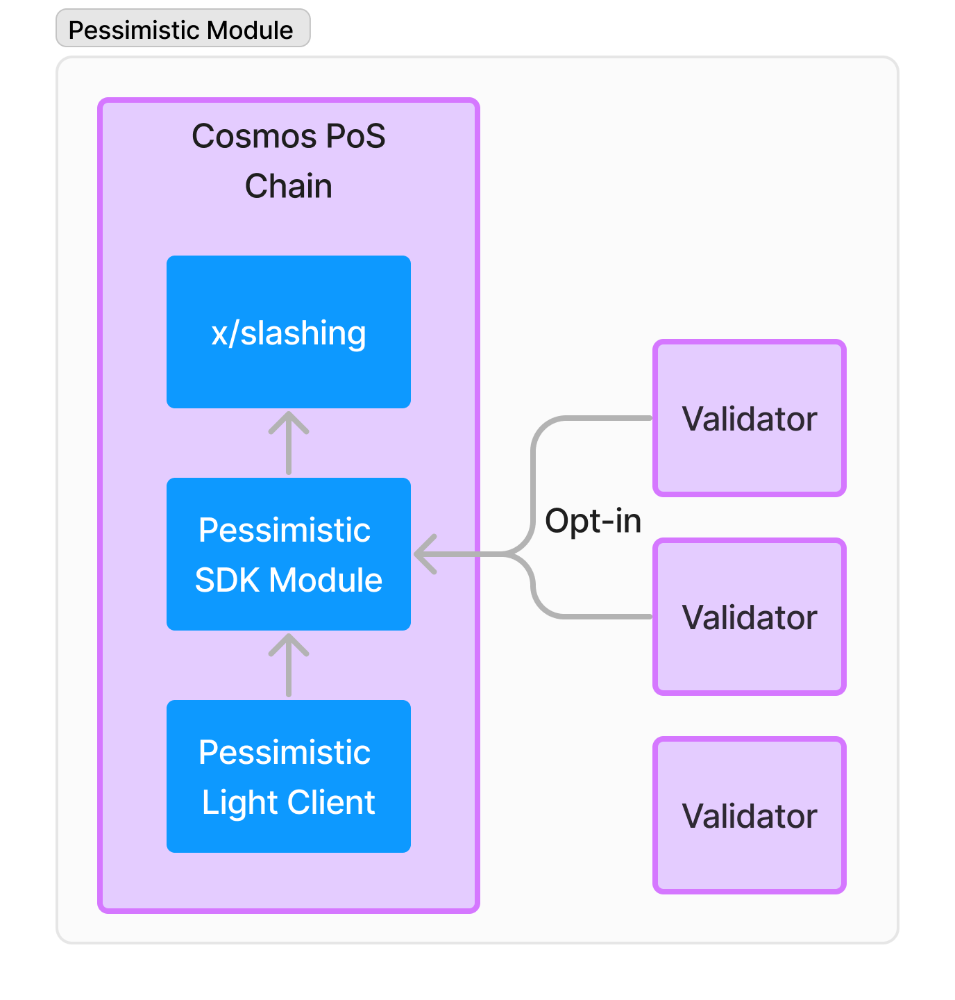

# Pessimistic Validation

Short-term goal: to allow optimistic rollups to IBC without having to wait for the dispute period.

Long-term goal: to allow any chain (even one without provable merkle trees or single-slot finality) 
that can implement IBC able to connect to the Cosmos Ecosystem. Including Ethereum. 

This project was originally built for Celestia's Infinite Space Bazaar. 
You can find the original working proof of concept code here: 
https://github.com/gjermundgaraba/pessimistic-validation/tree/9bc691c585697921b84c5467b13996389e6d119f

The project is getting some funding from Dorahacks ATOM Economic Zone Quadratic Grant rounds.
You can find project information and contribute to the project here: https://dorahacks.io/aez

## Current status
The project is under development and being rewritten for a more production ready design and architecture.

Architectural decisions are in progress to nail down a production-ready design, and development is happening to test the ideas.

## Pessimistic Validation

Pessimistic validation is where you validate all the blocks on a counterparty chain, rather than optimistically trust it or waiting for dispute periods.
This is essentially the way most full L1 blockchains works today, but with a twist: 
a rollup can still run as an optimistic rollup and the receiver chain can
pessimistically validate the rollup chain with a partial set from their own validators.
In addition, the pessimistic validation can be used for non-rollup chains that are not easily provable (like Ethereum or Solana) as long
as the validator set on the receiving chain are able to come to consensus on the state of their counterparty chain.

One important aspect of Pessimistic Validation to make it reasonable for a large chain to run is to have the ability 
to have configurable security. This means that the receiving chain can decide how many validators (and stake) they 
want to put behind the validation of the counterparty chain.

Specifically for optimistic rollups, to bridge assets you normally need to wait for the dispute period to pass before you can trust the rollup
and the assets bridged over. This is because the rollup chain can be rolled back if a fraud proof is submitted within the dispute period.

Anyone can however validate the rollup themselves with a full node, but it doesn't help the receiving chain unless 
it can either validate it itself or a have a trusted party validate it.

The goal of pessimistic validation is to allow a receiving chain to have a partial set of its validators validate their 
counterparty chain and sign off on the state and heights they trust. 
This way the receiving chain can trust the counterparty chain without having to wait for the dispute period to pass, 
and assets can be bridged over quickly.

