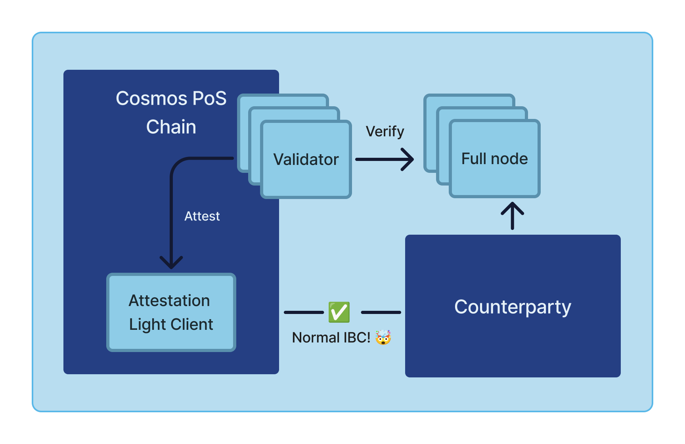

# Interchain Attestation

(Previously known as Pessimistic Validation)

Interchain Attestation is a project to enable IBC everywhere. In particular, IBC for chains that can't/don't have a 
light client implementation that can be used with IBC. It enables IBC for any chain that can implement IBC, and
let another chain safely validate it (for instance by running a full node). This then includes optimistic rollups,
Ethereum, Solana, and more.

The project is partially funded by the Dorahacks ATOM Economic Zone Quadratic Grant rounds.
You can find project information and contribute to the project here: https://dorahacks.io/aez

## Current status
The project is under development and is not yet ready for production use.

## Interchain Attestation

Interchain Attestation enables IBC connectivity (with no intermediary chains) with any chain where you can't/don't have a light client.

Interchain Attestation solves the problem where you can't, for whatever reason, trust the counterparty with a "normal" light client. 
Instead, it allows a chain's validators to attest to the state of the counterparty - moving the security to someone you already trust.

This enables any chain to connect with IBC, as long as it can implement the IBC protocol (e.g. smart contracts), 
and the validators using Interchain Attestation are attesting to the state of the counterparty IBC implementation.

Interchain Attestion is based on using validators with existing economic security to attest to the state of the counterparty chain.
We move the security assumption over to the receiving validator set (e.g. Cosmos Hub/Osmosis/whatever), away from the one we can't trust (like a single sequencer).

In addition, the Attestation light client is based on attesting to IBC packets, rather than full state.
This makes it much easier to implement new chains and support consensus algorithms that doesn't (yet?) have a light client implementation.

The Attestation light client verifies the signatures of the attestors (validators) and stores the packet commitments to be able to verify the packet later.

Not all scenarios warrant all validators running a full node and attesting to every chain it connects to, 
so Interchain Attestation also has a config module that allows for configurable security requirements.

The architecture is using a combination of a sidecar process, ABCI++ Vote Extensions, and a light client to enable the attestation process.

A talk about the project can be found here: https://www.youtube.com/watch?v=loNyUjSgR8M

## Development

### Prerequisites

TODO: Add rest of prerequisites

* Just
* Go
* Docker (for e2e tests)
* golangci-lint

### Testing

Each module has a unit test suite that can be run with `make test`.

You can also run all unit tests with for all modules with `just test-unit`.

In addition, there is an e2e test suite that can be run using `make interchaintest` (under `testing/`).
Before running the test, however, you need to build the docker images (which is required for every change you make to the code) with `make docker-images`.

### Linting

You can lint all modules with `just lint`.

### Proto generation

If you make changes to the proto files, you need to regenerate the go code with `just proto-gen` (or `make proto-gen` in the module directories).

### Running locally

You can spin up a local testnet using `make serve` (under `testing/`. This spins up two chains, configures a sidecar process, and sets up an IBC connection with clients, connections and channels.

To stop all the processes, run `make kill-all`.

## Background

This project was originally built by Gjermund Garaba (https://github.com/gjermundgaraba/, https://twitter.com/gjermundgaraba)
for Celestia's Infinite Space Bazaar to solve the problem of waiting for the dispute period to pass when bridging assets from an optimistic rollup to a receiving chain.

You can find the original working proof of concept code here:
https://github.com/cosmos/interchain-attestation/tree/9bc691c585697921b84c5467b13996389e6d119f