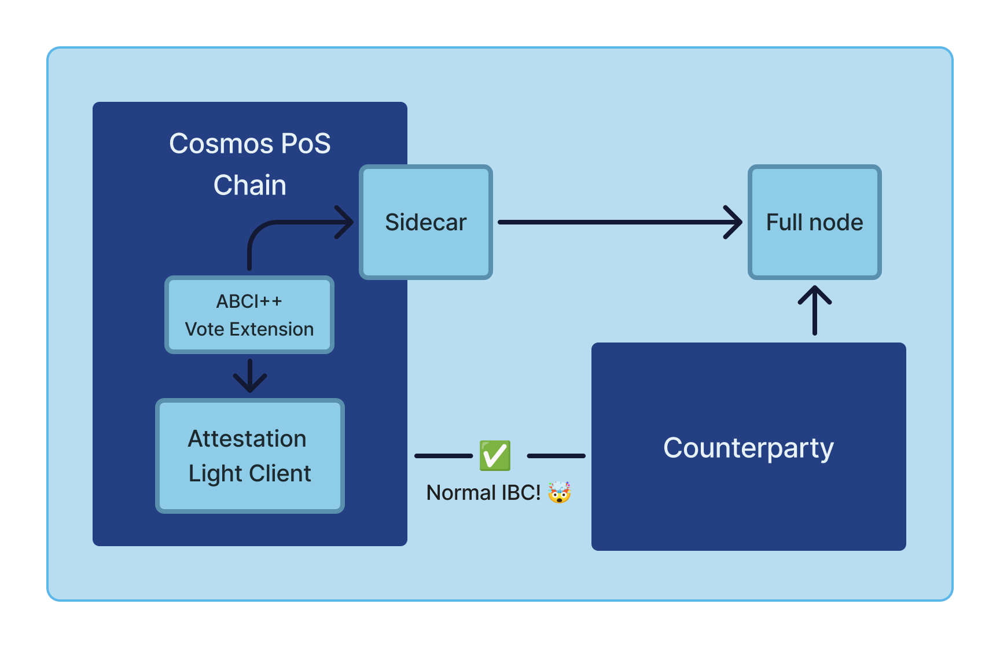

# Architecture

Interchain Attestation is composed of a few different components that work together to let validators safely attest to the state of a counterparty chain. 
The main components, in "chronological order" are:
* Attestation Config Module
  * Validators register their signing keys
  * Chains/clients are registered for attestation with configuration details 
* Attestation Sidecar
  * Validators run a sidecar that reads counterparty chain information, and generates signed attestations
  * The sidecar also hosts a GRPC server that can be queried for attestations (used by the chain node to fetch attestations during vote extensions)
* Vote Extensions
  * Uses the ABCI++ interface with vote extensions to fetch attestations from the sidecar
  * Attestations are aggregated from all the validators, and sent to the light client for verification and client updates
* Attestation Light Client
  * The IBC light client that uses the attestation data to enable IBC connections
  * The light client verifies the attestations and updates the client state and consensus state with packet commitments
* Testing
  * In addition there are some development tools used to test the system: interchaintest and some simapps integrated with the above components

## Flow

TODO: Add a diagram

