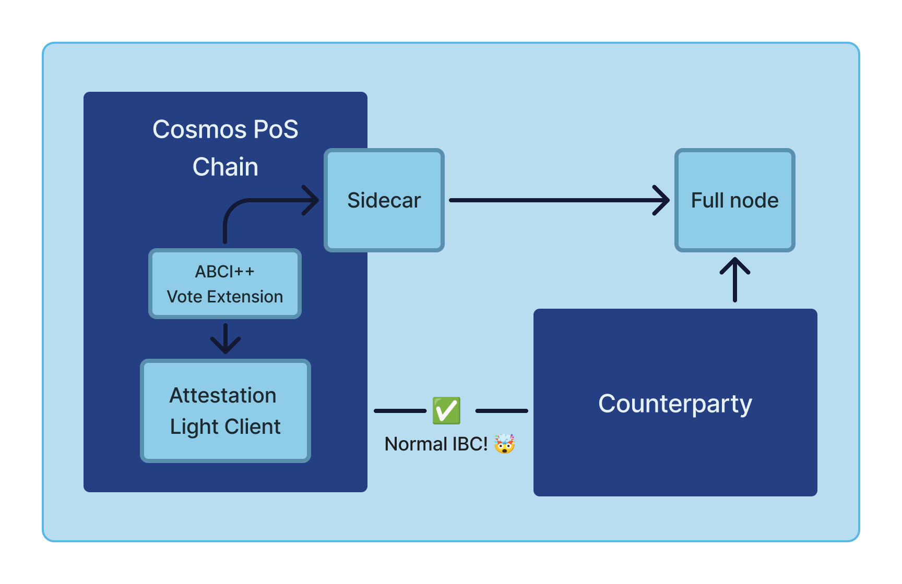

# System Architecture and Flow

## Component Overview

Interchain Attestation is composed of a few different components that work together to let validators safely attest to the state of a counterparty chain.
The main components, in "chronological order" are:
* Attestation Config Module
    * Chains/clients are registered for attestation with configuration details
    * Verifies that attestation sets follow the configured rules (e.g. enough voting power has voted)
* Attestation Sidecar
    * Validators run a sidecar that reads counterparty chain information, and generates attestations
    * GRPC server that serves attestations (used by the chain node to fetch attestations during vote extensions)
* Vote Extensions
    * Uses the ABCI++ interface with vote extensions to fetch attestations from the sidecar
    * Attestations are aggregated from all the validators, and sent to the light client for verification and client updates
* Attestation Light Client
    * The IBC light client that uses the attestation data to enable IBC connections
    * The light client verifies the attestations and updates the client state and consensus state with packet commitments
* Testing
    * In addition, there are some development tools used to test the system: interchaintest and some simapps integrated with the above components

## Flow

### Before packets can flow

A few things need to happen before packets can flow between chains:
1. The Attestation Light Client, Vote Extensions and Attestation Config Module is integrated with the chain
    * To learn more about how to integrate into your chain, see the [Integration Guide](../integration-guide) 
2. Clients are created on both chains, and registered with the Attestation Config Module
    * ⚠️For v1, pre-Eureka, we also need to create connections and channels. 
    * In v2, only IBC Eureka is supported, and connections and channels are finally a thing of the past.
3. Sufficient Validators have signed up to attest to the counterparty chain (if the configuration requires it)
4. Validators have configured and started up their Attestation Sidecar process

### Normal operation

At this point, we have clients on both chains, and validators who are expected to attest to the counterparty chain.

The flow of the system for the client to get updated is as follows:
1. The sidecar process reads all configured counterparty chain states, generates attestations, and stores them in the sidecar database
2. The ABCI++ Vote Extensions query the sidecar for the latest attestations
3. The Vote Extensions aggregate the attestations from all the validators, and send them to the light client
4. The light client verifies the attestations, and updates the client state and consensus state with the packet commitments

We now have a light client that can verify packet commitments, and IBC can flow between the chains.

TODO: Add a diagram

TODO: Write about relaying
