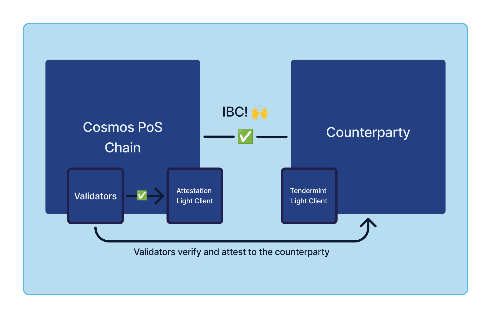
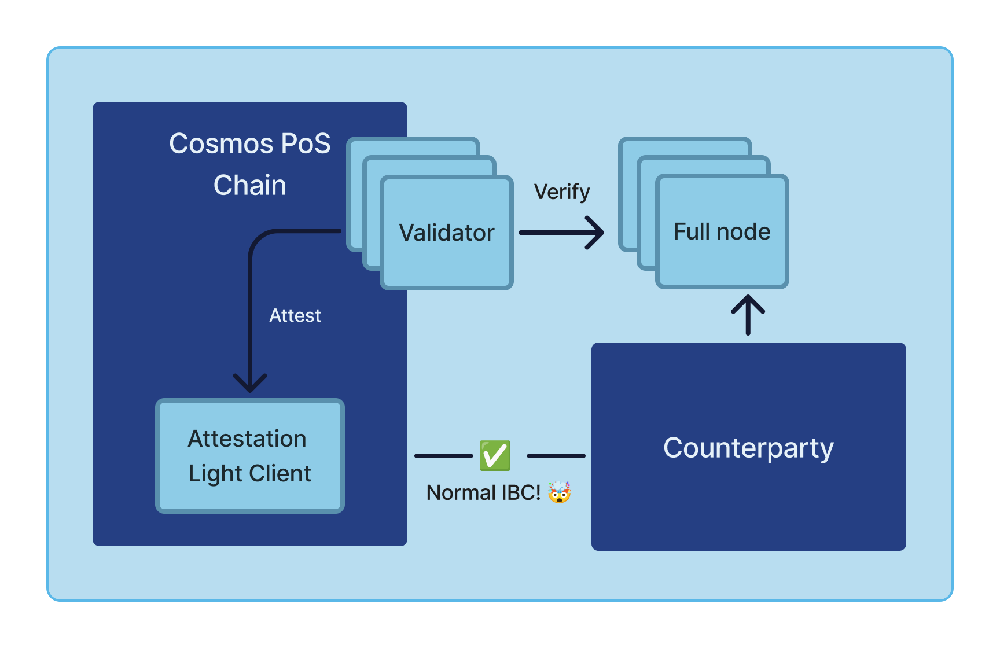

# Introduction

Interchain Attestation is a project to enable IBC everywhere. In particular, IBC for chains that can't/don't have a
light client implementation that can be used with IBC. It enables IBC for any chain that can implement IBC, and
let another chain safely validate it (for instance by running a full node). This then includes optimistic rollups,
Ethereum, Solana, and more.

The system enables any chain to connect with IBC, as long as it can implement the IBC protocol (e.g. smart contracts),
and the validators using Interchain Attestation are attesting to the state of the counterparty IBC implementation.

## How it works

High level, Interchain Attestation uses the validators to attest to the state of the counterparty chain. The validators
are running a sidecar process, and a full node of the counterparty chain. The sidecar process reads the state of the
counterparty chain, and the full node validates the state of the counterparty chain. The validators then sign the
attestation, and the attestation is fetched, validated and aggregated by the node binary using ABCI++ Vote Extensions.

To dive deeper into how everything works, see the [architecture](./architecture) pages.

A talk about the project from Modular Summit (this was before the name change from Pessimistic Validation to Interchain Attestation) can be found here:
<iframe width="560" height="315" src="https://www.youtube.com/embed/loNyUjSgR8M?si=7fs9pqlKhuP7gHVx" title="YouTube video player" frameborder="0" allow="accelerometer; autoplay; clipboard-write; encrypted-media; gyroscope; picture-in-picture; web-share" referrerpolicy="strict-origin-when-cross-origin" allowfullscreen></iframe>

TODO: Use cases (maybe a separate page?)

TODO: Links to other pages (for validators, for chain developers, etc.)